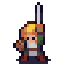
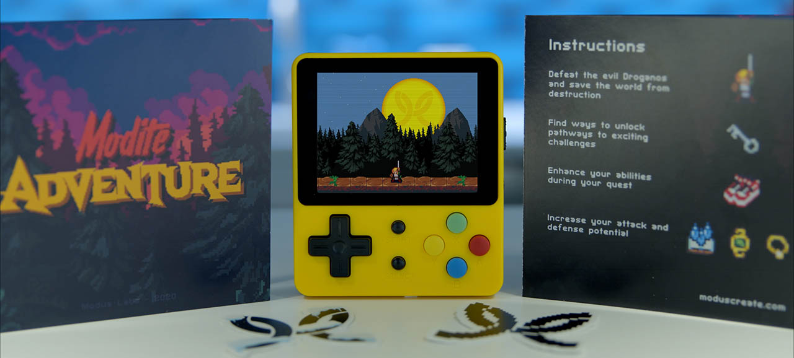
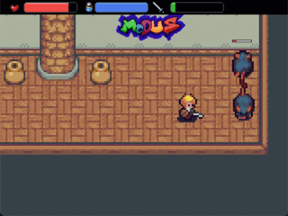
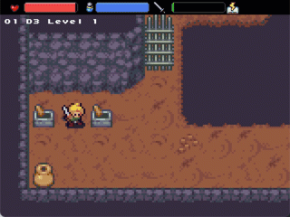
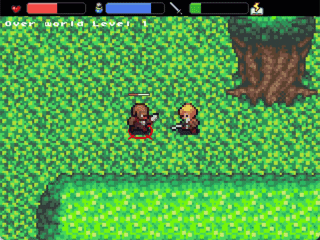
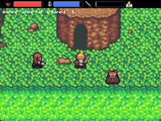
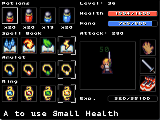
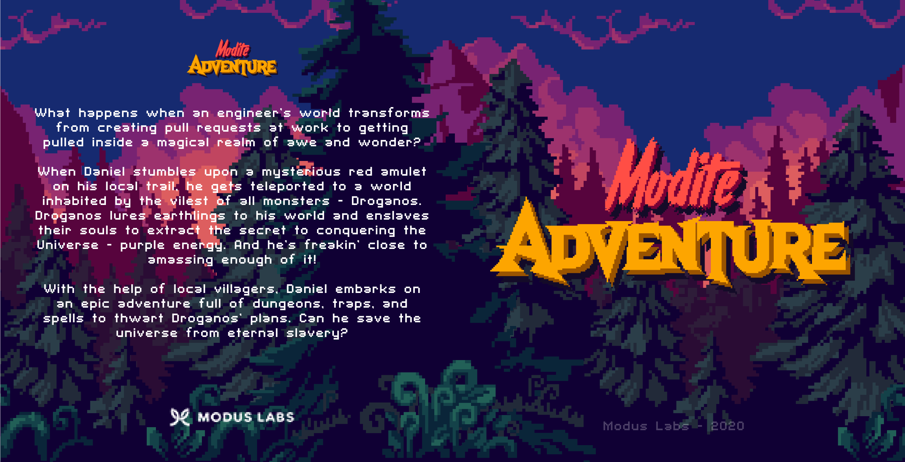
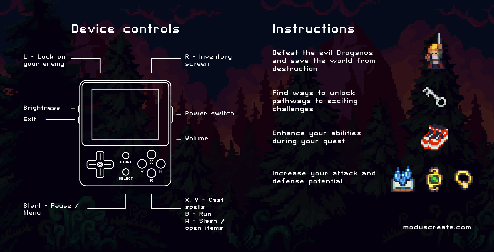

# Modite Adventure 

[![Powered by Modus_Create](https://img.shields.io/badge/powered_by-Modus_Create-blue.svg?longCache=true&style=flat&logo=data:image/svg+xml;base64,PHN2ZyB2aWV3Qm94PSIwIDAgMzIwIDMwMSIgeG1sbnM9Imh0dHA6Ly93d3cudzMub3JnLzIwMDAvc3ZnIj4KICA8cGF0aCBkPSJNOTguODI0IDE0OS40OThjMCAxMi41Ny0yLjM1NiAyNC41ODItNi42MzcgMzUuNjM3LTQ5LjEtMjQuODEtODIuNzc1LTc1LjY5Mi04Mi43NzUtMTM0LjQ2IDAtMTcuNzgyIDMuMDkxLTM0LjgzOCA4Ljc0OS01MC42NzVhMTQ5LjUzNSAxNDkuNTM1IDAgMCAxIDQxLjEyNCAxMS4wNDYgMTA3Ljg3NyAxMDcuODc3IDAgMCAwLTcuNTIgMzkuNjI4YzAgMzYuODQyIDE4LjQyMyA2OS4zNiA0Ni41NDQgODguOTAzLjMyNiAzLjI2NS41MTUgNi41Ny41MTUgOS45MjF6TTY3LjgyIDE1LjAxOGM0OS4xIDI0LjgxMSA4Mi43NjggNzUuNzExIDgyLjc2OCAxMzQuNDggMCA4My4xNjgtNjcuNDIgMTUwLjU4OC0xNTAuNTg4IDE1MC41ODh2LTQyLjM1M2M1OS43NzggMCAxMDguMjM1LTQ4LjQ1OSAxMDguMjM1LTEwOC4yMzUgMC0zNi44NS0xOC40My02OS4zOC00Ni41NjItODguOTI3YTk5Ljk0OSA5OS45NDkgMCAwIDEtLjQ5Ny05Ljg5NyA5OC41MTIgOTguNTEyIDAgMCAxIDYuNjQ0LTM1LjY1NnptMTU1LjI5MiAxODIuNzE4YzE3LjczNyAzNS41NTggNTQuNDUgNTkuOTk3IDk2Ljg4OCA1OS45OTd2NDIuMzUzYy02MS45NTUgMC0xMTUuMTYyLTM3LjQyLTEzOC4yOC05MC44ODZhMTU4LjgxMSAxNTguODExIDAgMCAwIDQxLjM5Mi0xMS40NjR6bS0xMC4yNi02My41ODlhOTguMjMyIDk4LjIzMiAwIDAgMS00My40MjggMTQuODg5QzE2OS42NTQgNzIuMjI0IDIyNy4zOSA4Ljk1IDMwMS44NDUuMDAzYzQuNzAxIDEzLjE1MiA3LjU5MyAyNy4xNiA4LjQ1IDQxLjcxNC01MC4xMzMgNC40Ni05MC40MzMgNDMuMDgtOTcuNDQzIDkyLjQzem01NC4yNzgtNjguMTA1YzEyLjc5NC04LjEyNyAyNy41NjctMTMuNDA3IDQzLjQ1Mi0xNC45MTEtLjI0NyA4Mi45NTctNjcuNTY3IDE1MC4xMzItMTUwLjU4MiAxNTAuMTMyLTIuODQ2IDAtNS42NzMtLjA4OC04LjQ4LS4yNDNhMTU5LjM3OCAxNTkuMzc4IDAgMCAwIDguMTk4LTQyLjExOGMuMDk0IDAgLjE4Ny4wMDguMjgyLjAwOCA1NC41NTcgMCA5OS42NjUtNDAuMzczIDEwNy4xMy05Mi44Njh6IiBmaWxsPSIjRkZGIiBmaWxsLXJ1bGU9ImV2ZW5vZGQiLz4KPC9zdmc+)](https://moduscreate.com/?utm_source=labs&utm_medium=github&utm_campaign=genus)

Modite Adventure is a cross-platform a action/adventure created by [Modus Create](https://moduscreate.com) for the 2020 holiday season. Modite Adventure's target platform is the [LDK Game](https://retromimi.com/products/ldk-game) console, and can compile and run on macOS and Linux (Ubuntu and Arch distributions).

For build instructions, take a look at our [development documentation](https://github.com/ModusCreateOrg/modite-adventure/wiki).

Click the image below to watch the trailer.

We really hope you enjoy playing this game as much as we enjoyed making it! ❤️

## Game Play

The goal of Modite Adventure is to defeat Droganos, the final Boss. To do this, you are required to earn the four spell books that are guarded by the four Wizards scattered throughout dungeons in the over world.

Modite Adventure’s presentation is that of the typical ¾ RPG (Role Playing Game) perspective and its gameplay design’s inspiration was taken from a few video games decades past, with the basic mechanics of the run, attack, and receiving damage taking cues from games like the Legend of Zelda: A Link to the Past.

Here’s an example of the slash attack mechanic slaying an enemy

Dungeons are puzzles to be solved and have doors blocking pathways. Some doors are locked and can be opened with keys, while others are unlocked via button presses or by finding the right combination of switches on the ground.

General enemies have distinct behavior patterns and will either walk around aimlessly, explore their world, or attack from afar. Some might even directly confront our hero and depending on how the enemy behaves, you might want to have our hero “lock on” to it to ensure it doesn’t get the best of you!

Sometimes our hero will find himself surrounded and depending on if he’s located a spellbook he can unleash a spell of epic proportions to vanquish those evil monsters.

There is no doubt that we recognize that our hero’s quest is difficult, with every enemy he slays, he earns Experience points to level up his abilities. Each time he levels up, all of his basic stats increase, including his overall health and magic points along with his attack and defense. Details about our hero can be viewed on the inventory screen.

It likely wouldn't surprise you to learn that this game took a little over a year to develop by a relatively small team of 4 core developers. I’ll caution that using the time dimension to project the level of effort is extremely misleading because the majority of this game was developed nights and weekends. We made this possible by coupling our love for video games with our passion for creativity.

## Instruction Insert

Here is the instruction card that we created as an insert to the game we delivered to our clients and team.

# Modus Create

[Modus Create](https://moduscreate.com) is a digital product consultancy. We use a distributed team of the best talent in the world to offer a full suite of digital product design-build services; ranging from consumer facing apps, to digital migration, to agile development training, and business transformation.

 

This project is part of [Modus Labs](https://labs.moduscreate.com/?utm_source=labs&utm_medium=github&utm_campaign=genus).

## License
Genus is licensed under [GPL v3](./LICENSE).

# Contributing
Interested in contributing to Genus? Please see our [developing](https://github.com/ModusCreateOrg/modite-adventure/wiki) wiki and [contributions](./md/CONTRIBUTIONS.MD) guidelines. 
