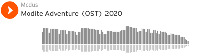

## Music
Click below to listen to the entire Modite Adventure Sound track.
]

**Composer: Jay Garcia**
- [Dungeon1.xm](https://soundcloud.com/moduscreate/dungeon1?in=moduscreate/sets/modite-adventure-ost-2020)
- [Dungeon2.xm](https://soundcloud.com/moduscreate/dungeon2?in=moduscreate/sets/modite-adventure-ost-2020)
- [Dungeon3.xm](https://soundcloud.com/moduscreate/dungeon3?in=moduscreate/sets/modite-adventure-ost-2020)
- [Dungeon4.xm](https://soundcloud.com/moduscreate/dungeon4?in=moduscreate/sets/modite-adventure-ost-2020) (Original: ["Sad song" by darkman007](https://modarchive.org/index.php?request=view_by_moduleid&query=172778) - remixed with permission.)
- [Dungeon7.xm](https://soundcloud.com/moduscreate/dungeon7?in=moduscreate/sets/modite-adventure-ost-2020)
- [Dungeon8.xm](https://soundcloud.com/moduscreate/dungeon8?in=moduscreate/sets/modite-adventure-ost-2020)
- [Dungeon9.xm](https://soundcloud.com/moduscreate/dungeon1?in=moduscreate/sets/modite-adventure-ost-2020) (Original: ["Slumberjack" by raina](https://modarchive.org/index.php?request=view_by_moduleid&query=148721) - remixed with permission.)
- [Dungeon_Home.xm]()
- [Ending_Theme.xm](https://soundcloud.com/moduscreate/ending-theme?in=moduscreate/sets/modite-adventure-ost-2020)
- [Ending_Theme_extended.xm](https://soundcloud.com/moduscreate/ending-theme-extended?in=moduscreate/sets/modite-adventure-ost-2020)
- [GameOver.xm](https://soundcloud.com/moduscreate/gameover?in=moduscreate/sets/modite-adventure-ost-2020)
- [Logo_Reveal.xm](https://soundcloud.com/moduscreate/logo-reveal?in=moduscreate/sets/modite-adventure-ost-2020)
- [Main_Menu.xm](https://soundcloud.com/moduscreate/main-menu-1?in=moduscreate/sets/modite-adventure-ost-2020)
- [Overworld.xm](https://soundcloud.com/moduscreate/overworld?in=moduscreate/sets/modite-adventure-ost-2020)
- [Boss_1.xm](https://soundcloud.com/moduscreate/boss-1?in=moduscreate/sets/modite-adventure-ost-2020)
- [Boss_2.xm](https://soundcloud.com/moduscreate/boss-2?in=moduscreate/sets/modite-adventure-ost-2020)
- [Boss_3.xm](https://soundcloud.com/moduscreate/boss-3?in=moduscreate/sets/modite-adventure-ost-2020)

**Composer: Victor Guzman**
- [Dungeon5.xm](https://soundcloud.com/moduscreate/dungeon5?in=moduscreate/sets/modite-adventure-ost-2020)
- [Dungeon6.xm](https://soundcloud.com/moduscreate/dungeon6?in=moduscreate/sets/modite-adventure-ost-2020)

## Sound Effects
The sound effects in Modite Adventure are mainly sourced from the [OpenGameArt.org](https://opengameart.org) [The Essential Retro Video Game Sound Effects Collection \[512 sounds\].zip](https://opengameart.org/content/512-sound-effects-8-bit-style) pack ([License](https://creativecommons.org/publicdomain/zero/1.0/)). We also did some ad-hoc recording and mashing up of some of the SFX to give the game some unique flavor.

## Images
The following 
- Hero & general enemy sprites:  [RPG Monster Pack](https://pita.itch.io/rpg-monster-pack) ([License](https://www.gamedevmarket.net/terms-conditions/#pro-licence)).
- Icons: [Pixeltier's 16x16 Icon pack](https://pixeltier.itch.io/pixeltiers-16x16-rpg-icon-pack) ([License](https://pixeltier.itch.io/pixeltiers-16x16-rpg-icon-pack))
- Bosses: [Time Fantasy Monsters Asset Pack](https://finalbossblues.itch.io/time-fantasy-monsters) ([License](https://www.gamedevmarket.net/terms-conditions/#pro-licence))
- Background Tiles: [Time Fantasy(Various)](https://www.timefantasy.net/) ([License](https://www.gamedevmarket.net/terms-conditions/#pro-licence))
- Spell animations: [Retro Pixel Bosses](https://perpetualdiversion.itch.io/retro-pixel-bosses)
